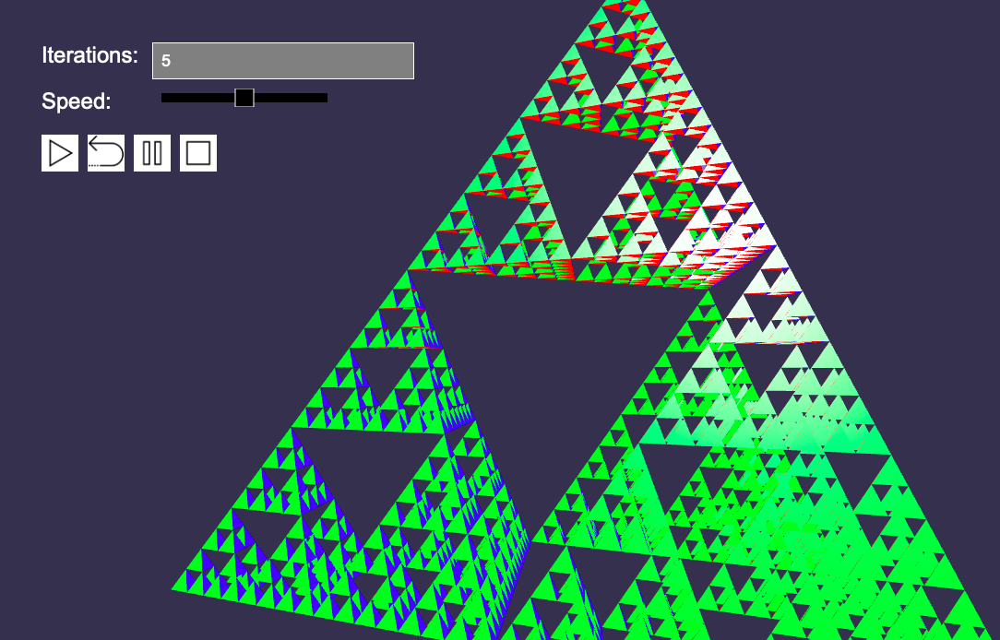

# Description:

The program visualises the creation of the Sierpinski fractal. I created new triangles by calculating the centre-points of the previous triangle-edges and using those as the the new vertices. Then i rotated the new triangle that lies in the middle around the axis to its left.

# Run:

Start the program by double clicking the index.html file

# Unser interface:

The animation should work fine up to 5 iterations and starts being slower if the iterations are increased

Play: start the animation
Reverse: reverse the animation (till it is back to the initial tetrahedron)
Pause: Pause animation
Stop: Reload the initial tetrahedron
